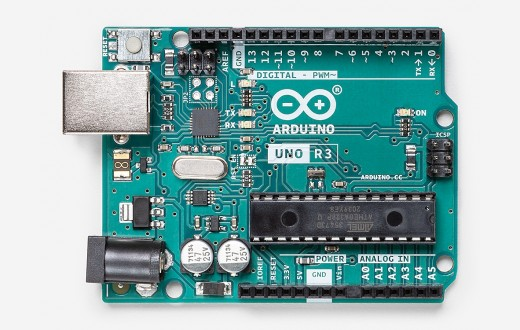
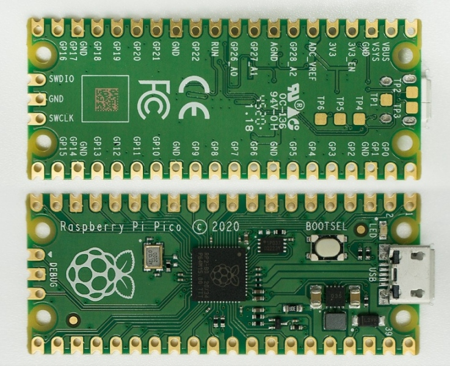

## Micro-Controller-Introduction

---

### by Jogi 

---

* Short History / Introduction
* Different Micro-Controllers
* Programming-Environments
* Microcontroller-Learning-Environments
* Back to History
* Demo ("Hello World")

---

### My first computer (6502 CPU)

---

### This _IS_ my first computer

---

### KIM 1-Clone (6502 CPU) 

---

### Apple ][ (6502 CPU)

---

### Commodore C64 (6502 CPU)

---

### Why show my first computer?

2 Main reasons 

* Good explanation of Architecture
* Come back later in presentation ... 

---

### Architecture of Junior

---

### The 6502 CPU

---

### Architecture of Junior

---

### The 6532 (RAM I/O Timer)

---

### Programming

---

## some years later ...

---

### Siemens 80c166

---

### 80c166 Architecture

{height=80%}

---

### Programming Environment

---

### In its environment

---

### Final Product

---

### Interim Summary

* Concept of MC (Micro-Controller) is old
* Programming needs Cross-Toolchain
* usually complicated setup
* difficult to start with
* not fitting the needs of "hobbyist"

---

### 2006 Arduino enters the world

* Arduino is a ECO-system
* Hardware ("standardised") with AVR-MC
* Hardware : rather cheap, open designs
* so called Shields : to be stacked on top
* Software is for free 
* Rather easy, but complete "IDE"
* includes/hides all details incl download
* Processing => Windows/Mac/Linux

---

### Arduino UNO

---

### Arduino Leonardo

---

### Shields (I)

---

### Shields (II)

---

### Shields (III)

---

### Shields (IV)

---

### Block-Diagramm AVR 

---

### "THE" innovation 

---

### "All in one"
 

---

### The IDE

---

### Nice Arduino-Simulator

* https://wokwi.com/arduino/libraries/Servo/Knob

---

### 2012 Raspberry PI Enters the world

---

### __STOP__ : Raspberry Pi is __NOT__ a Micro-Controller

---

### Raspberry PI

* Is NOT a Micro Controller
* Is based on an ARM-Cortex Application-Processor
* Its CPU is intended to run General Purpose OS for Multi-User/Multi-Task, eg Linux
* the fancy stuff ( Memory Management Unit, Caches, ... ) 
* difficult to setup for "simple" Controller-Tasks
* common with Micro-Controllers: especially PINS to be used as GPIO, I2C, SPI-Bus, ...
* "Nice" project about Bare-Metal on Raspberry PI (see links)

---

### 2014 : ESP 8266 enters the world

(Target of future lightning talk)

### 2016 : ESP 32 enters the world

(Target of future lightning talk)

---

### In the meantime : ARM

* Acorn RISC Machine
* From the beginning: 32 Bit (16 Bit Thumb-Mode)
* now: 3 categories
   * ARM Cortex A (Application Processor)
   * ARM Cortex M (Micro-Controller)
   * ARM Cortex R (Realtime-CPU)

---

### Arduinos and other => ARM

* Still AVR available
* More power => ARM
* Arduino-IDE able to cover them all
* through board-library

---

### ARM 

* Sells IP only, no HW
* Therefore ARMs from a lot of different silicon vendors
* Actual : ARM is beeing aquired
* You know by whom ?

---

### Yes: Linus best friend...

---

### 2021 Raspberry Pi Pico enters the world

---

### Raspberry Pi Pico

* just another Micro-Controller 
* But 3 interesting aspects
    * is from the Raspberry-PI foundation => might attract new "customers"
    * breaks with the "Has to run with Arduino-IDE"-Dogma 
    * Has at least one interesting HW-Block, the PIO

---

### Raspberry Pi Pico

* always starts as UF2-Board
* looks like a USB-Stick
* Microsoft-defined USB-Format
* especially dedicated for downloading firmware to MC via USB
* Cannot put just e.g. python-Files on it

---

### The PICO itself

---

### The PINs of PICO

---

### The Blocks of PICO

---

### Raspi Pico Dev Environements

* Plain SDK (Assembler/C/C++)
* Micropython
* Circuitpython
* Arduino-IDE

---

### PICO as U2F-USB Mass-Storage

---

### Dev-Environment : SDK 

---

### Dev-Environement : SDK (cmake)

---

### Python 

* Micro-Python
* Circuit Python

---

### Micro-Python

* Attempt to put Python on Micro-Controller-Boards
* Started with an own Board
* Interpreter now available for a lot of µC-Boards
* Including the Raspberry-Pi Pico

---

### Dev-Env Micro-Python

---

### Circuit-Python

* Is a fork of Micro-Python
* Done/maintained by Adafruit
* A lot of differences in the libraries
* Main difference visible : Provides a "real" USB-Drive

---

### Dev-Env Circuit-Python

---

### Arduino for the PICO

* was not in the focus of Raspberry-Pi organisation
* started as community-project
* since end of April 2021 : officially supported

---

### Installation via Board-Library

---

### Dev-Environement : Arduino

---

### The PIO

* Programmable IO
* "a Co-Processor", dedicated to programm even new serial "buses"
* offloads work from the CPU, compared to "bit-banging"
* https://www.cnx-software.com/2021/01/27/a-closer-look-at-raspberry-pi-rp2040-programmable-ios-pio/

---

### Conclusion for PICO

4 Different Dev-Environments

* C/C++ - SDK via cmake and U2F-Filesystem
* Micro-Python with USB-serial / Thonny
* Circuit-Python with real filesystem
* Arduino - IDE 

Choose yourself

---

## And one final slide

| "Computer" | CPU      | Bus | Freq | RAM  | ROM  | Price | 
|------------|----------|-----|------|------|------|-----|
| Junior     | 6502     | 8   | 1    | 1k   | 1k   | 350 | 
| Siemens P1 | 80c166   | 16  | 13   | 32k  | 256k | 1200 | 
| Arduino    | AVRU     | 8   | 16   | 2k   | 32k  | 10  | 
| PI Zero    | ARM11    | 32  | 1000 | 512M | SD   | 15  | 
| PI Pico    | ARM C M0 | 32  | 133  | 264k | 16M  | 5   | 

---

### Why Jogis first computer

---

### 3 years ago: 20 CHF

---

### Link-Collection

* see git-repo (branch gh_pages)
* https://github.com/jogi-k/micro-controller-slides/tree/gh-pages

---

### Legal stuff

* Von Rama &amp; Musée Bolo - Eigenes Werk, CC BY-SA 2.0 fr, https://commons.wikimedia.org/w/index.php?curid=11292404
* Von Narnars0 - Eigenes Werk, CC BY-SA 3.0, https://commons.wikimedia.org/w/index.php?curid=32247697
* Von Evan-Amos - Eigenes Werk, Gemeinfrei, https://commons.wikimedia.org/w/index.php?curid=17414886

---

### The END 

