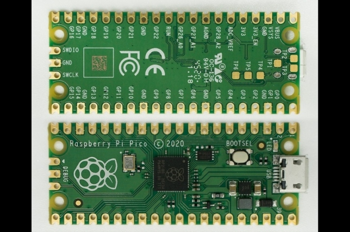
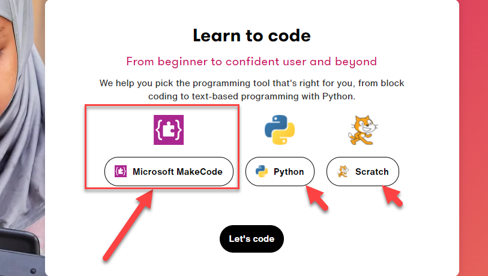

## Micro-Controller Learning Platforms

---

### by Jogi 

---

* Recap last micro-controller talk
* Shortcomings of the micro-controllers
* Target-Group
* Programming-Environment
* Micro:Bit 
* Calliope 
* Other resources 

---

### Short recap 

* complicated setup
* Arduino enters the world => all in one
* Raspberry Pi Pico => Python
* More : Look at https://jogi-k.github.io/micro-controller-slides/

---

### Micro-Controller 

* something to control 
   * LED
   * Motor
   * others
* somehow be controlled
   * Sensors
   * Switches
   * external events
* Actors / Sensors

---

### Arduino 

---

### Arduino : no actors/sensors

---

### Raspberry Pi Pico  

---

### Raspberry Pi Pico: ONE LED

---

### My target group 

* Newstarters in Computers
* Newstarters in Electronics
* Want to program, not only consuming
* Children, starting ~ 9y
* Want to _control_ something

---

### Micro:BIT 

* Launched in 2016 by BBC in UK
* Target: Every Schoolkid ~ 12y has one
* Platform
* [Web-Editor](https://makecode.microbit.org/#editor)
* Simulator 

---

### The Micro:BIT Board

---

### Micro:BIT Homepage

---

### Demo-Time 1

[https://makecode.microbit.org/#editor](https://makecode.microbit.org/#editor)

---

### What we (hopefully) saw

* https://microbit.org/
* Editor : https://makecode.microbit.org/
* Simple-Programm : https://makecode.microbit.org/_dt5boP7AKaqj
* Fill-Screen : https://makecode.microbit.org/_R8d2zWgbsUmg
* Moodsend : https://makecode.microbit.org/_VAiVxqE3CgDP

---

### Germany : Improvements ...

* Target-Group : Children < 12
* Even better suited for small fingers
* some more sensors/actors
    * Microphone
    * Loudspeaker ("Silent"-Speaker)
    * RGB - LED
    * Ability to drive Motor(s)
    * Grove-Sensor-Interface

---

### 2017 Calliope enters world

---

### Calliope Resources 

* [The Home Page](https://calliope.cc/) 
* [The Editors](https://calliope.cc/programmieren/editoren)
* [Microsoft Makecode](https://makecode.calliope.cc/#editor) 
* Lots of documentation available in German
* Even Schoolbook publishers have books in PDF for free
* Look at my training for teachers, big collection

---

### The content of my course

---

### Demo - Time

[Makecode-Editor](https://makecode.calliope.cc/#editor)

---

###  The Demos

(what we hopefully saw)

* Music : https://makecode.calliope.cc/_hYViPH0ugafK
* Temperature : https://makecode.calliope.cc/_7tUUJ46crPyf
* Alarm-System : https://makecode.calliope.cc/_Ro34x3U6F7sL 
* The Remote-Control : see on my trainings-page http://calliope-jogi.org

---

### My target-group (pre Corona)

---

### My target-group (post Corona)

---

### Other Resources 

* Kniwwelino : the "same" in Luxembourg, with ESP8166 ==> WLAN
* Sinobit : the "same" in China, much more LEDs, no ECO-system

---

---

---

### Enhancements/Eco-System

* Grove-Sensors for Calliope 
* lots of motheboards for Micro:BIT
* e.g. : Edu-Bit

---

---

### Conclusion

* German speaking => Start with Calliope
* English speaking => Start with Micro:BIT

## Have fun !

---

### Link-Collection

* Part 1: https://jogi-k.github.io/micro-controller-slides/
* Sources : https://github.com/jogi-k/micro-controller-slides/tree/gh-pages
* Part 2:  https://jogi-k.github.io/micro-controllers-part2/
* Sources : https://github.com/jogi-k/micro-controllers-part2/tree/gh-pages
* All of Jogis Trainings-Material (German) : http://calliope-jogi.org/

---

### The END 

